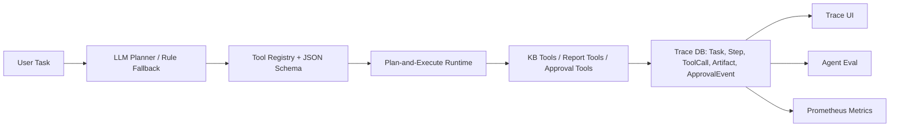

# SmartRAG - AI 智能知识库系统

<p align="center">
  
  
  
  
</p>

SmartRAG 是一个基于 RAG（检索增强生成）技术的智能知识库系统，支持文档上传、自动切片、向量检索与智能问答。

---

## 特性

- **多格式文档支持**: PDF、Markdown、Word、TXT
- **智能文档切片**: 可配置的 chunk size 和 overlap
- **持久化向量检索**: 基于 Chroma 的向量存储和知识库过滤检索
- **混合检索**: BM25 + 向量检索融合，可通过 `RETRIEVAL_MODE` 切换
- **重排序**: BGE Reranker 提升检索精度，可启用 `hybrid_rerank`
- **来源追溯**: 返回 `document_id`、`chunk_id`、`rank`、`score` 等来源字段
- **Agent Runtime**: 支持任务规划、工具调用、状态机执行、trace 落库和报告 artifact
- **Human-in-the-loop**: 外部发布类写操作进入 `needs_approval`，审批后恢复执行
- **流式输出**: SSE 实时流式响应
- **多知识库**: 支持多租户知识库隔离
- **对话历史**: 支持多轮对话上下文
- **用户认证**: JWT + RBAC 权限管理
- **API 限流**: 基于 IP 和用户的双层限流
- **监控指标**: Prometheus 格式 metrics 端点
- **Docker 部署**: 一键部署到生产环境

---

## 技术栈

| 层级 | 技术 |
|------|------|
| 后端框架 | FastAPI |
| 前端框架 | React + TypeScript + Vite + Tailwind CSS |
| AI 能力 | 自研 RAG 编排 + OpenAI-Compatible Provider 封装 |
| 向量数据库 | Chroma |
| 大模型 | DeepSeek / Qwen / OpenAI / Ollama |
| Embedding | BGE-M3 / BGE-Large |
| 重排序 | BGE-Reranker-v2-m3 |
| 数据库 | PostgreSQL |
| 缓存 | Redis |
| 部署 | Docker + Nginx |

---

## AgentOps 能力

SmartRAG 已从知识库问答扩展为任务型 Agent Runtime。用户可以提交任务，例如：

```text
根据知识库里的部署文档，生成一份上线 checklist，并指出缺失的监控项。
```

Agent 会自动生成计划、调用工具、保存 trace，并输出 Markdown 报告。

| 模块 | 能力 |
|------|------|
| Agent Runtime | `AgentTask` / `AgentStep` / `ToolCall` / `AgentArtifact` 落库 |
| Tool Registry | `search_kb`、`list_documents`、`get_document_preview`、`summarize_document`、`compare_documents`、`create_report`、`ask_rag`、`publish_report` |
| Planner / Executor | 支持 `AGENT_PLANNER_MODE=rule|llm_fallback|llm`，LLM 结构化规划会经过工具 schema 校验，失败时可回退到确定性 Plan-and-Execute |
| Trace UI | 前端 `/agent` 页面展示任务结果、工具输入输出、耗时、错误和状态 |
| Human Approval | `publish_report` 等外部写操作需要审批 |
| Agent Eval | `task_success_rate`、`tool_call_accuracy`、`citation_correctness`、`schema_valid_rate`、`avg_steps`、`p95_latency` |

Agent API：

```bash
POST /api/v1/agent/tasks
GET  /api/v1/agent/tasks
GET  /api/v1/agent/tasks/{id}
GET  /api/v1/agent/tasks/{id}/events
POST /api/v1/agent/tasks/{id}/approve
POST /api/v1/agent/tasks/{id}/reject
```

`POST /api/v1/agent/tasks` 默认会立即返回 `task_id`，实际执行交给 FastAPI background task；前端通过轮询/SSE 查看 `pending -> planning -> running -> completed/needs_approval` 状态，长任务不会阻塞 HTTP 请求。

Agent 评测：

```bash
python scripts/run_agent_eval.py --dataset agent_evals/tasks.jsonl
python scripts/run_agent_eval.py --dataset agent_evals/tasks.jsonl --mode execute
python scripts/record_llm_planner_demo.py --output docs/assets/llm-planner-demo.json
```

当前内置 Agent 评测集包含 33 个任务，覆盖知识库问答、摘要、文档对比、报告生成、监控审计、发布审批、权限拒绝、失败恢复和 schema 合法性等场景。

Agent 架构：



Demo 录制建议：

1. 运行 `python scripts/seed_demo.py --mock-embeddings` 准备数据。
2. 设置 `AGENT_PLANNER_MODE=llm_fallback` 并配置 LLM API Key。
3. 打开 `/agent`，提交“根据知识库里的部署文档，生成一份上线 checklist，并指出缺失的监控项。”
4. 展示 planner mode、tool calls、token/cost、trace timeline 和最终 Markdown 报告。
5. 展示 Sources 区域，点击 chunk 链接回溯到 `/api/v1/documents/{document_id}/chunks/{chunk_id}`。
6. 再提交“根据部署文档生成报告并发布到外部渠道。”，展示 `needs_approval`、approval event 和 `publish_report`。
7. 将录制文件放到 `docs/assets/agent-trace-demo.gif` 后，可在 README 使用 `` 展示。

## 快速开始

### 前置要求

- Python 3.11+
- PostgreSQL 15+
- Redis 7+
- Docker (可选)

### 安装

```bash
# 克隆项目
git clone https://github.com/gaosanliukoushui/smart_rag.git
cd smart_rag

# 创建虚拟环境
python -m venv .venv
source .venv/bin/activate  # Linux/Mac
# 或
.venv\Scripts\activate  # Windows

# 安装依赖
pip install -r requirements.txt

# 复制环境变量配置
cp .env.example .env
# 编辑 .env 填入你的 API Key
```

### 配置

编辑 `.env` 文件，填入你的配置：

```env
# DeepSeek API
DEEPSEEK_API_KEY=your-api-key

# 或使用 Qwen
LLM_PROVIDER=qwen
QWEN_API_KEY=your-api-key
```

RAG 检索链路可按场景切换：

```env
RETRIEVAL_MODE=vector          # vector / hybrid / hybrid_rerank
BM25_TOKENIZER=char_ngram      # simple / jieba / char_ngram
RAG_EVAL_DATASET=evals/qa_set.jsonl
```

### 运行（手动部署）

```bash
# 启动开发服务器
uvicorn app.main:app --reload --port 8000
```

### 运行（Docker 部署）

```bash
cd docker
docker-compose up -d
```

访问 http://localhost:8000/docs 查看 API 文档。

前端开发服务器：

```bash
cd frontend
npm install
npm run dev
```

### 一键 Demo 数据

启动数据库后可导入示例账号、知识库、文档、切片和向量：

```bash
# 快速演示：不下载 embedding 模型，使用确定性 mock 向量
python scripts/seed_demo.py --mock-embeddings

# 真实链路：使用 .env 中的 EMBEDDING_MODEL 生成向量
python scripts/seed_demo.py
```

默认示例账号：

```text
username: demo
password: DemoPass123!
```

---

## 项目结构

```
SmartRAG/
├── app/
│   ├── api/              # API 路由
│   │   └── v1/           # API v1 版本
│   ├── capabilities/     # AI 能力封装
│   │   ├── embedding/    # Embedding 模型
│   │   ├── llm/         # LLM 模型
│   │   └── rerank/       # 重排序模型
│   ├── chunkers/         # 文档切片
│   ├── core/             # 核心模块
│   ├── db/               # 数据库连接
│   ├── middleware/       # 中间件（限流、日志）
│   ├── models/           # 数据模型
│   ├── parsers/          # 文档解析器
│   ├── schemas/          # Pydantic Schema
│   ├── services/         # 业务服务
│   └── vectorstores/     # 向量存储
├── docker/               # Docker 配置
├── docs/                 # 详细文档
│   ├── api.md            # API 文档
│   ├── architecture.md   # 架构文档
│   └── deployment.md    # 部署文档
├── frontend/             # React 前端
├── scripts/              # 工具脚本
└── tests/                # 测试
```

---

## API 文档

### 健康检查

```bash
GET /api/v1/health
```

### 文档管理

```bash
# 上传文档
POST /api/v1/documents/upload

# 文档列表
GET /api/v1/documents

# 获取文档
GET /api/v1/documents/{document_id}

# 删除文档
DELETE /api/v1/documents/{document_id}
```

### 知识库管理

```bash
# 创建知识库
POST /api/v1/knowledge-bases

# 知识库列表
GET /api/v1/knowledge-bases

# 获取知识库
GET /api/v1/knowledge-bases/{kb_id}

# 删除知识库
DELETE /api/v1/knowledge-bases/{kb_id}
```

### 问答

```bash
# 发送消息
POST /api/v1/chat
{
  "message": "你的问题",
  "knowledge_base_id": "知识库ID",
  "stream": true
}

# 获取历史
GET /api/v1/chat/history/{session_id}
```

---

## 开发

### 运行测试

```bash
# 运行所有测试
pytest

# 运行带覆盖率
pytest --cov=app tests/

# 运行特定测试
pytest tests/unit/test_chunkers.py
```

### RAG 评测

```bash
python scripts/run_rag_eval.py --dataset evals/qa_set.jsonl
```

当前轻量评测集用于 CI smoke test，输出 `Recall@5`、`MRR`、`nDCG`、引用覆盖率和延迟分位数。随着 demo 文档扩展，可以继续加入业务问题和期望命中片段。

```bash
python scripts/run_rag_eval.py --dataset evals/qa_set.jsonl --compare-modes
```

当前内置评测集结果：

| 检索链路 | Recall@5 | MRR | nDCG | 引用覆盖率 | 说明 |
|----------|----------|-----|------|------------|------|
| `vector` | 1.00 | 1.00 | 0.75 | 1.00 | 确定性向量基线 |
| `hybrid` | 1.00 | 1.00 | 0.75 | 1.00 | 向量 + BM25 RRF 融合 |
| `hybrid_rerank` | 1.00 | 1.00 | 1.00 | 1.00 | Hybrid 候选 + 轻量 rerank smoke test |

### Agent 评测

```bash
python scripts/run_agent_eval.py --dataset agent_evals/tasks.jsonl
python scripts/run_agent_eval.py --dataset agent_evals/tasks.jsonl --mode execute
```

当前内置 Agent Eval smoke-test / execute-test 结果：

| 指标 | 当前结果 |
|------|----------|
| task_success_rate | 1.00 |
| tool_call_accuracy | 1.00 |
| citation_correctness | 1.00 |
| schema_valid_rate | 1.00 |
| avg_steps | 约 4.61 |
| execute_p95_latency_ms | 约 114 |
| failure_recovery_rate | 1.00 |

### 代码规范

```bash
# 检查代码
ruff check app/

# 格式化代码
ruff format app/
```

---

## 开发路线图

### 阶段一：最小可用 RAG

- [x] ~~项目初始化~~
- [x] ~~配置与基础设施~~
- [x] ~~数据模型~~
- [x] ~~文档解析器~~
- [x] ~~文档切片~~
- [x] ~~AI 能力封装~~
- [x] ~~向量存储~~
- [x] ~~业务服务层~~
- [x] ~~API 路由~~
- [x] ~~主应用入口~~

### 阶段二：重点优化

- [x] ~~混合检索~~
- [x] ~~Prompt 工程~~
- [x] ~~流式输出~~
- [x] ~~对话历史~~
- [x] ~~重排序 (Rerank)~~
- [x] ~~文档管理增强~~
- [x] ~~性能优化~~

### 阶段三：高级特性

- [x] ~~多知识库隔离~~
- [x] ~~Docker 部署~~
- [x] ~~用户认证~~
- [x] ~~本地模型支持~~
- [x] ~~监控与日志~~
- [x] ~~API 限流~~
- [x] ~~文档增量更新~~

详见 [todo_list.md](todo_list.md) 和 [docs/](docs/) 目录下的详细文档：

- [API 文档](docs/api.md) - 所有 API 端点的完整参考
- [架构文档](docs/architecture.md) - 系统架构、RBAC 模型、数据流
- [部署文档](docs/deployment.md) - Docker 部署、手动部署、环境变量说明
- [Demo 指南](docs/demo.md) - 示例数据、评测命令、录屏/截图检查点
- [项目技术文档](PROJECT_DOC.md) - 适合快速了解架构和核心链路

---

---

## 贡献

欢迎提交 Issue 和 Pull Request！

---

## 许可证

MIT License
