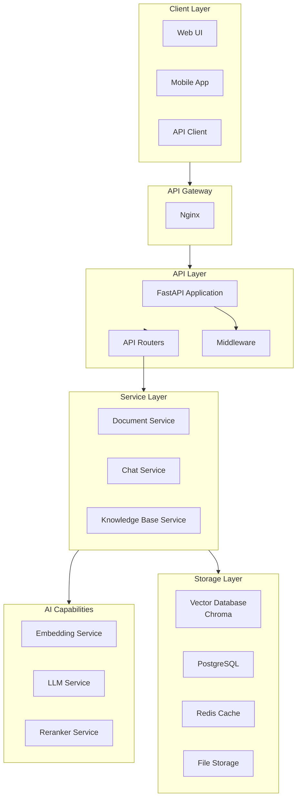
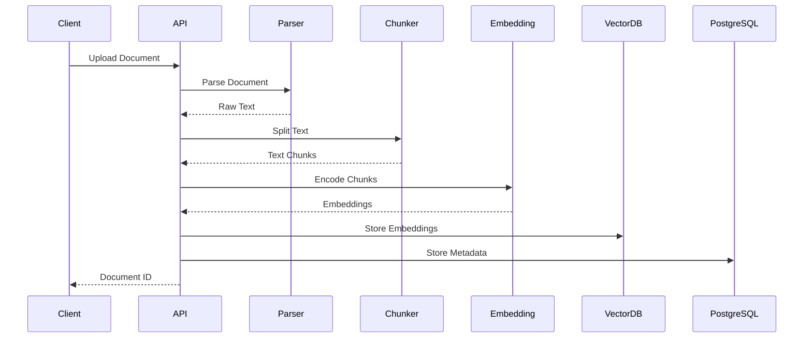
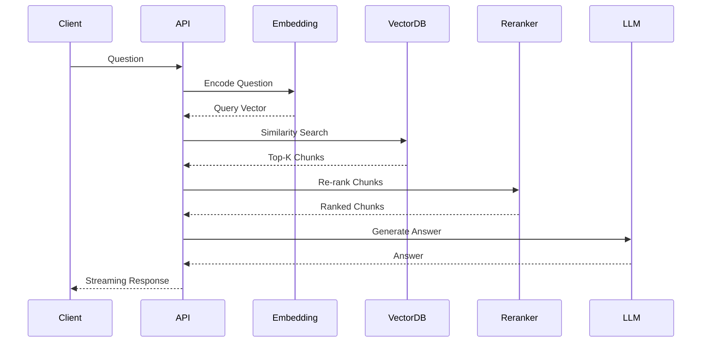

# SmartRAG Architecture Documentation

## Overview

SmartRAG is a RAG (Retrieval-Augmented Generation) based intelligent knowledge base system built with FastAPI.

## Architecture Diagram

## Component Responsibilities

### Client Layer

- Web UI, Mobile App, or API clients
- Communicates via REST API
- Supports streaming responses via SSE

### API Layer

- **FastAPI Application**: Main ASGI application
- **API Routers**: Versioned endpoints (`/api/v1/`)
- **Middleware**: CORS, logging, authentication

### Service Layer

| Service | Responsibility |
|---------|---------------|
| DocumentService | Document upload, parsing, chunking |
| ChatService | RAG-powered chat with context |
| KnowledgeBaseService | Knowledge base CRUD operations |
| EmbeddingService | Text vectorization |
| RetrievalService | Similarity search |
| LLMService | Language model generation |

### AI Capabilities

| Component | Technology | Purpose |
|-----------|------------|---------|
| Embedding | BGE-M3 | Text vectorization |
| LLM | DeepSeek / Qwen / OpenAI | Answer generation |
| Reranker | BGE-Reranker | Result re-ranking |

### Storage Layer

| Storage | Technology | Purpose |
|---------|------------|---------|
| Vector Database | Chroma | Embedding storage & retrieval |
| Relational DB | PostgreSQL | Metadata, documents, chat history |
| Cache | Redis | Session cache, rate limiting |
| File Storage | Local disk | Uploaded files |

## Data Flow

### Document Upload Flow

### RAG Query Flow

## Technology Stack

### Backend

- **Framework**: FastAPI 0.115+
- **ASGI Server**: Uvicorn
- **ORM**: SQLAlchemy 2.0
- **Validation**: Pydantic 2.0

### AI/ML

- **Embedding**: Sentence Transformers (BGE-M3)
- **Vector Store**: Chroma
- **LLM Integration**: OpenAI-compatible API

### Infrastructure

- **Database**: PostgreSQL 15
- **Cache**: Redis 7
- **Container**: Docker

## Security

### Authentication (Planned)

- JWT-based authentication
- API key support for external clients

### Data Protection

- Environment variables for sensitive config
- Input validation with Pydantic
- SQL injection prevention via ORM

## Scalability Considerations

### Horizontal Scaling

- Stateless API design allows horizontal scaling
- Use Redis for shared session state
- Vector DB supports distributed deployment

### Performance Optimization

- Async I/O throughout the stack
- Connection pooling for databases
- Batch embedding for large documents
- Caching frequent queries in Redis
