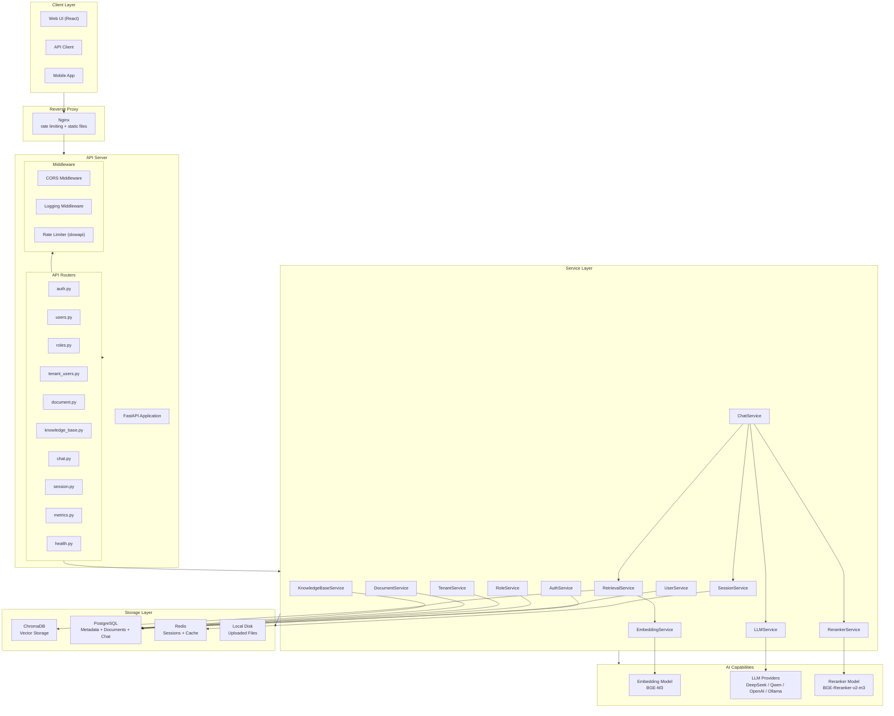
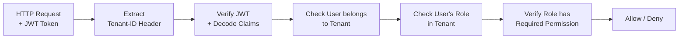
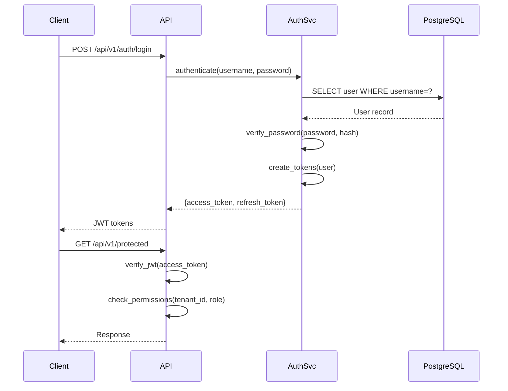
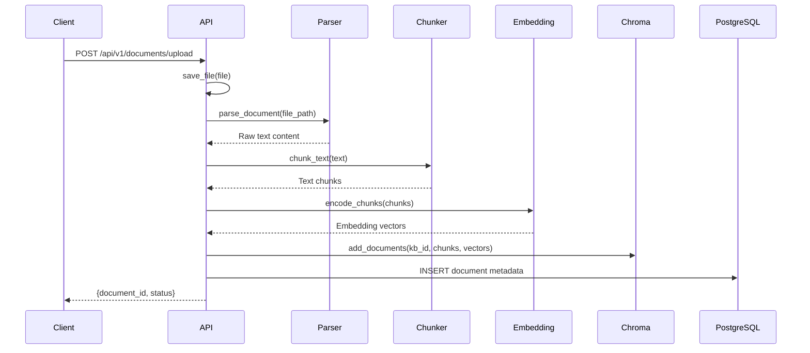
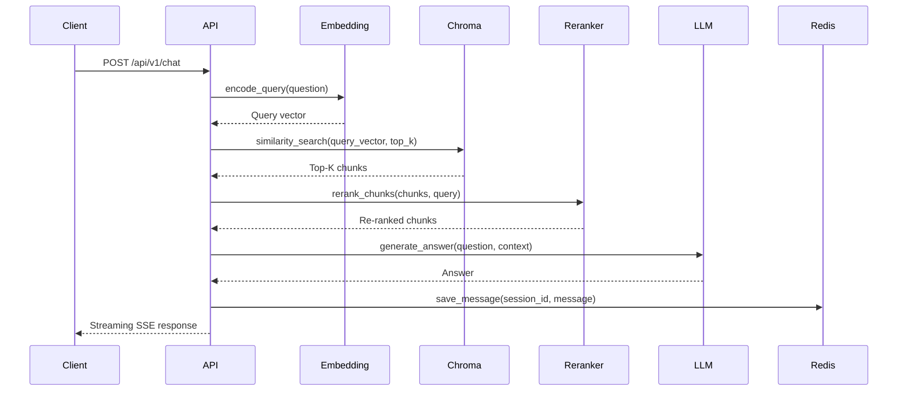

# SmartRAG Architecture Documentation

## Overview

SmartRAG is a multi-tenant RAG (Retrieval-Augmented Generation) knowledge base system built with FastAPI, supporting document upload, vector retrieval, intelligent chunking, and LLM-powered chat.

## Architecture Diagram



## Multi-Tenancy RBAC Model

SmartRAG implements a four-level access control model:

```mermaid
erDiagram
    Tenant ||--o{ UserRole : has
    User ||--o{ UserRole : has
    UserRole }o--|| Role : assigned_to
    Role ||--o{ Permission : has

    Tenant {
        uuid id PK
        string name
        string slug UK
        boolean is_active
        dict settings
        datetime created_at
    }

    User {
        uuid id PK
        string email UK
        string username UK
        string hashed_password
        string full_name
        boolean is_active
        boolean is_superuser
        string avatar_url
        datetime created_at
    }

    Role {
        uuid id PK
        string name
        string description
        boolean is_system
        datetime created_at
    }

    Permission {
        uuid id PK
        string resource
        string action
        string description
    }

    UserRole {
        uuid user_id FK
        uuid tenant_id FK
        uuid role_id FK
        PRIMARY KEY (user_id, tenant_id, role_id)
    }
```

### Access Control Flow



## Authentication Flow



## Document Upload Flow



## RAG Query Flow



## Key Module Responsibilities

| Module | File | Responsibility |
|--------|------|----------------|
| Auth | `app/services/auth_service.py` | Registration, login, JWT issuance, token refresh |
| Users | `app/services/auth_service.py` | User profile CRUD |
| Roles | Role management service | Role CRUD, permission assignment |
| Tenants | `app/api/v1/tenant_users.py` | Tenant CRUD, user-role assignment per tenant |
| Documents | `app/services/document_service.py` | Upload, parse (PDF/DOCX/MD/TXT), reparse |
| Chunkers | `app/chunkers/` | Configurable text splitting strategies |
| Knowledge Bases | `app/services/knowledge_base_service.py` | KB CRUD, document management |
| Chat | `app/services/chat_service.py` | RAG orchestration, streaming response |
| Sessions | `app/services/session_service.py` | Redis-backed session/memory storage |
| Embedding | `app/capabilities/embedding/` | BGE-M3 model loading, text encoding |
| LLM | `app/capabilities/llm/` | DeepSeek, Qwen, OpenAI, Ollama providers |
| Reranker | `app/capabilities/rerank/` | BGE-Reranker-v2-m3 cross-encoder |
| Vector Store | `app/vectorstores/` | ChromaDB integration |

## Technology Stack

### Backend

| Layer | Technology | Version |
|-------|-----------|---------|
| Framework | FastAPI | 0.115+ |
| ASGI Server | Uvicorn | multi-worker |
| ORM | SQLAlchemy | 2.0+ |
| Validation | Pydantic | 2.0+ |
| Rate Limiting | slowapi | |
| Logging | Custom structured logging | |

### Frontend

| Layer | Technology | Version |
|-------|-----------|---------|
| Framework | React | 18.3 |
| Language | TypeScript | 5.7 |
| Build Tool | Vite | 6.1 |
| Router | React Router DOM | 6.28 |
| HTTP Client | Axios | 1.7 |
| Styling | Tailwind CSS | 3.4 |

### AI / ML

| Component | Technology | Purpose |
|-----------|-----------|---------|
| Embedding | BAAI/bge-m3 | Text vectorization |
| Reranker | BAAI/bge-reranker-v2-m3 | Result re-ranking |
| LLM | DeepSeek / Qwen / OpenAI / Ollama | Answer generation |
| Vector DB | Chroma | Embedding storage and retrieval |

### Infrastructure

| Component | Technology | Purpose |
|-----------|-----------|---------|
| Database | PostgreSQL | Metadata, documents, chat history |
| Cache | Redis | Session storage, rate limit counters |
| Container | Docker | Application packaging |
| Reverse Proxy | Nginx | Rate limiting, load balancing, static files |
| File Storage | Local disk | Uploaded documents |

## Security

### Authentication

- JWT-based authentication with access + refresh token pattern
- Access tokens expire in 30 minutes (configurable)
- Refresh tokens expire in 7 days (configurable)
- Rate limiting on auth endpoints (5/hour register, 10/min login)

### Authorization

- Multi-tenant RBAC: Tenant -> UserRole -> Role -> Permission
- System roles (e.g., `admin`) are protected and cannot be modified
- Tenant-level isolation: users can only access tenants they belong to
- Superuser bypasses tenant-level checks

### Data Protection

- Environment variables for all sensitive configuration
- Input validation with Pydantic models throughout
- SQL injection prevention via SQLAlchemy ORM parameterized queries
- File upload size limit (100MB default)

## Scalability

### Horizontal Scaling

- Stateless API design allows horizontal scaling behind Nginx
- Redis for shared session state across multiple workers
- Chroma supports distributed deployment for vector operations

### Performance Optimization

- Async I/O with `asyncio` throughout the stack
- SQLAlchemy async sessions for non-blocking DB access
- Connection pooling for PostgreSQL
- Batch embedding for large documents
- SSE streaming for chat responses (reduce TTFT)
- Redis caching for frequent queries
- Nginx rate limiting to protect backend from overload

### Session Management

Redis-backed session storage with in-memory fallback:

- Chat history persisted to Redis with configurable TTL
- Falls back to in-memory dict if Redis is unavailable
- Sessions can be listed, deleted, or cleared via API
