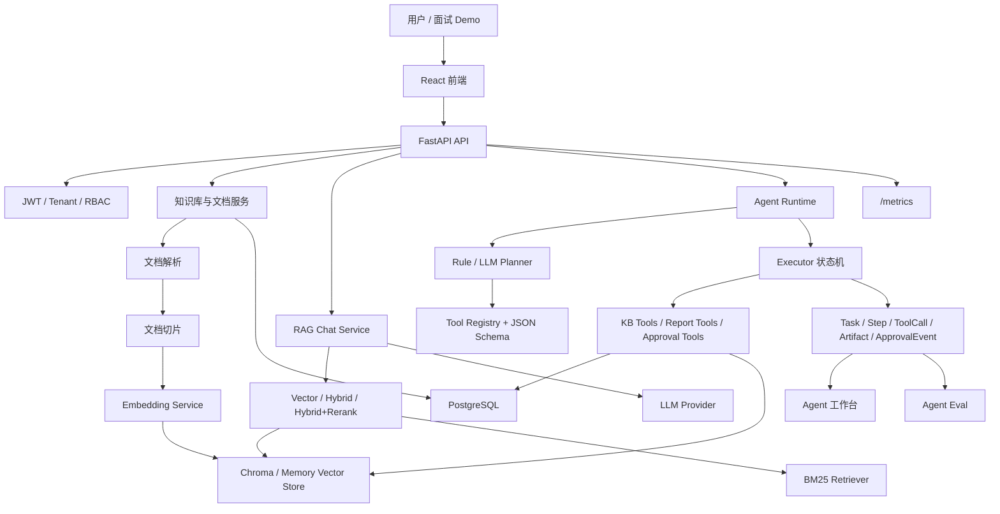
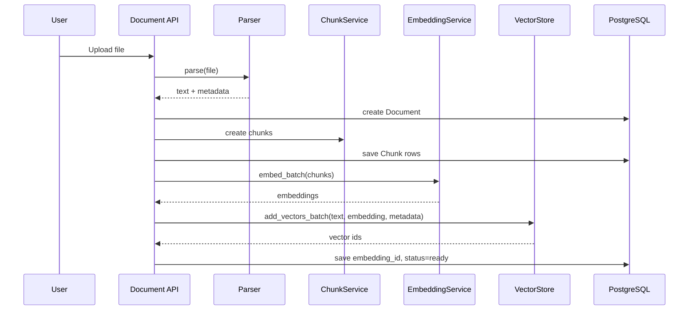
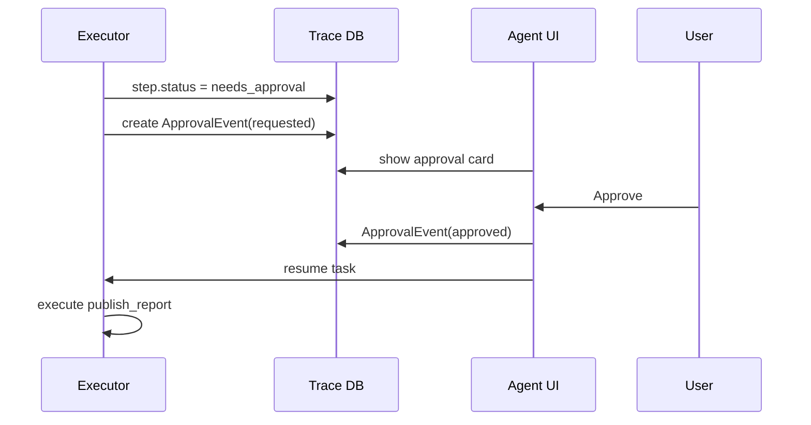

# SmartRAG 项目深度文档

本文档用于快速、完整地理解 SmartRAG 的项目定位、核心架构、RAG 链路、Agent Runtime、工具系统、评测体系、工程化设计和后续演进方向。读完后，应当能够在面试中清楚解释“这个项目解决什么问题、为什么这样设计、核心技术细节是什么、如何证明它真的可用”。

## 1. 项目定位

SmartRAG 最初是一个企业知识库 RAG 系统，后来升级为面向知识库任务执行的 Agent 系统。它不是一个简单的“上传文档后聊天”的 demo，而是一个具备任务规划、工具调用、执行 trace、人工审批、可观测指标和评测脚本的 Knowledge Agent 项目。

项目可以用一句话概括：

> SmartRAG 是一个面向企业知识库的 RAG-powered Agent 系统，支持文档解析、向量检索、BM25 混合检索、rerank、流式问答、来源追溯、任务型 Agent 执行、Human-in-the-loop 审批、Agent trace 可视化和 RAG/Agent 自动评测。

典型任务示例：

```text
根据知识库里的部署文档，生成一份上线 checklist，并指出缺失的监控项。
```

系统会自动完成：

1. 创建 Agent task。
2. 生成结构化执行计划。
3. 调用知识库检索、文档摘要、文档对比、报告生成等工具。
4. 保存每一步 tool call trace。
5. 输出 Markdown 报告和引用来源。
6. 对写操作或外部发布操作进入人工审批。
7. 通过 eval 脚本统计任务成功率、工具调用准确率、引用正确率和延迟。

## 2. 技术栈

| 层级 | 技术 |
|---|---|
| 后端框架 | FastAPI |
| ORM | SQLAlchemy 2.0 |
| 数据库 | PostgreSQL，测试/评测可使用 SQLite |
| 向量库 | Chroma 持久化向量库，内存向量库用于测试 |
| 文档解析 | PDF / Markdown / Word / TXT parser |
| 切片 | 固定长度 chunk + overlap |
| Embedding | BGE 系列模型，可 mock |
| Rerank | BGE reranker |
| LLM | DeepSeek / Qwen / OpenAI / Ollama，OpenAI-compatible client |
| 前端 | React + TypeScript + Vite + Tailwind CSS |
| 认证权限 | JWT + RBAC |
| 观测 | Prometheus text metrics |
| 部署 | Docker Compose + Nginx |
| 质量保障 | pytest、ruff、前端 build、RAG eval、Agent eval、GitHub Actions |

## 3. 总体架构



## 4. 核心目录说明

```text
app/
  api/v1/                 API 路由：auth、chat、document、knowledge_base、agent、metrics 等
  models/                 SQLAlchemy ORM 模型
  schemas/                Pydantic 请求/响应模型
  services/               业务服务层：RAG、Agent、文档、向量库、LLM 等
  parsers/                文档解析器
  chunkers/               文档切片策略
  db/                     数据库 session

frontend/src/
  pages/                  页面：知识库、文档、聊天、Agent 工作台
  api/client.ts           前端 API client 和类型
  components/             通用组件

scripts/
  run_rag_eval.py         RAG 评测脚本
  run_agent_eval.py       Agent 静态/真实执行评测脚本
  seed_demo.py            Demo 数据初始化
  record_llm_planner_demo.py 真实 LLM planner 输出记录

evals/
  qa_set.jsonl            RAG 评测集

agent_evals/
  tasks.jsonl             Agent 任务评测集

migrations/
  versions/0001_initial_schema.py  Alembic baseline

docs/
  demo.md                 Demo 流程
  deployment.md           部署说明
  project_deep_dive.md    本文档
  resume_guide.md         简历与面试写法
```

## 5. 数据模型

### 5.1 多租户与权限

核心实体：

| 模型 | 说明 |
|---|---|
| `Tenant` | 租户，隔离知识库、任务、用户角色 |
| `User` | 用户，支持 JWT 登录 |
| `Role` | 角色，可系统角色或自定义角色 |
| `Permission` | 权限，格式为 resource + action |
| `UserRole` | 用户在某个租户下的角色绑定 |

项目的多租户边界主要通过 `tenant_id` 控制。知识库、文档、Agent task 都会绑定租户，查询时必须带租户过滤，避免 A 租户召回 B 租户数据。

### 5.2 知识库模型

| 模型 | 说明 |
|---|---|
| `KnowledgeBase` | 知识库，属于某个租户 |
| `Document` | 上传文档，包含状态、版本、软删除字段 |
| `Chunk` | 文档切片，包含 `content`、`chunk_index`、`embedding_id` |

重要字段：

- `Document.status`：文档处理状态，如 `pending`、`ready`、`parsed`。
- `Document.file_hash` / `version`：用于增量更新和重解析。
- `Chunk.embedding_id`：指向向量库里的向量 ID。

### 5.3 Agent Runtime 模型

| 模型 | 说明 |
|---|---|
| `AgentTask` | 一个用户提交的任务，包含 goal、状态、plan、result |
| `AgentStep` | 任务计划中的一步，包含 tool、input、observation、status |
| `ToolCall` | 一次真实工具调用记录，包含 input/output、latency、token usage |
| `AgentArtifact` | Agent 产物，如 Markdown 报告或 failure report |
| `AgentApprovalEvent` | 人工审批事件，如 requested / approved / rejected |

Agent task 状态：

```text
pending -> planning -> running -> completed
                              -> needs_approval -> running -> completed
                              -> paused -> running
                              -> failed
                              -> cancelled
```

Step 状态：

```text
pending / running / completed / failed / needs_approval / approved / cancelled
```

## 6. 文档处理链路

上传文档后，系统会走以下流程：



向量元数据会保存：

- `knowledge_base_id`
- `document_id`
- `document_title`
- `chunk_id`
- `chunk_index`

这些字段用于后续来源追溯。

## 7. RAG 检索与问答链路

### 7.1 检索模式

通过环境变量控制：

```env
RETRIEVAL_MODE=vector          # vector / hybrid / hybrid_rerank
BM25_TOKENIZER=char_ngram      # simple / jieba / char_ngram
```

| 模式 | 说明 |
|---|---|
| `vector` | 只使用向量检索 |
| `hybrid` | 向量检索 + BM25，通过 RRF 融合 |
| `hybrid_rerank` | hybrid 候选结果再经过 reranker 重排 |

### 7.2 中文 BM25

BM25 默认空格分词对中文不友好，因此项目支持：

- `simple`：英文/空格文本。
- `jieba`：如果安装 jieba，可做中文分词。
- `char_ngram`：不依赖额外包，使用中文字符和 bigram，提高中文召回稳定性。

### 7.3 回答可靠性

Chat service 会做以下可靠性处理：

- 无召回结果时拒答，不编造。
- sources 返回可回溯字段：
  - `text`
  - `score`
  - `rank`
  - `document_id`
  - `document_title`
  - `chunk_id`
  - `chunk_index`
- 前端和 API 可以通过 `document_id/chunk_id` 回溯证据片段。

### 7.4 RAG 评测

评测文件：

```text
evals/qa_set.jsonl
scripts/run_rag_eval.py
```

指标：

- `Recall@5`
- `MRR`
- `nDCG`
- 引用覆盖率
- p50/p95 latency

示例命令：

```bash
python scripts/run_rag_eval.py --dataset evals/qa_set.jsonl --compare-modes
```

## 8. Agent Runtime 设计

### 8.1 为什么从 RAG 升级为 Agent

普通 RAG 只能回答一个问题，能力边界是：

```text
用户问题 -> 检索 -> 生成回答
```

而 Agent 的目标是处理任务：

```text
用户目标 -> 规划步骤 -> 调工具 -> 观察结果 -> 继续执行 -> 输出产物
```

例如“生成上线 checklist 并指出缺失监控项”不是单纯问答，它需要搜索、阅读、归纳、结构化输出和引用来源。

### 8.2 Planner

项目支持三种 planner 模式：

```env
AGENT_PLANNER_MODE=rule          # 稳定规则 planner
AGENT_PLANNER_MODE=llm_fallback  # 优先 LLM planner，失败回退 rule
AGENT_PLANNER_MODE=llm           # 强制 LLM planner
```

LLM planner 的特点：

- 输出必须是结构化 JSON。
- 每一步必须包含 `description`、`tool_name`、`tool_input`。
- 工具必须来自 Tool Registry。
- 工具输入会用 Pydantic schema 校验。
- 如果 LLM 输出非法工具、非法 JSON、缺字段，`llm_fallback` 会回退到 rule planner，并记录 `planner_error`。

这体现了一个真实 Agent 系统的重要原则：

> LLM 可以参与规划，但不能绕过工具白名单和 schema 校验。

### 8.3 Executor 状态机

Executor 执行步骤：

1. 如果 task 没有 plan，则先生成 plan。
2. 将 plan 展开为 `AgentStep`。
3. 按 step 顺序执行工具。
4. 每个 tool call 保存到 `ToolCall`。
5. 每步保存 latency、observation、error。
6. 遇到 approval 工具进入 `needs_approval`。
7. 任务恢复时重建已完成 step 的上下文。
8. 所有步骤完成后生成最终 result。

### 8.4 异步任务执行

API 层创建任务后立即返回，后台执行：

```text
POST /agent/tasks -> task_id
后台 BackgroundTask -> AgentService.run_task(task_id)
前端轮询/SSE -> 查看状态变化
```

当前使用 FastAPI `BackgroundTasks`，适合 demo 和轻量项目。如果要进一步生产化，可升级为 Redis + RQ/Celery/Arq，支持持久化任务队列、worker 重启恢复、并发控制和超时管理。

### 8.5 Pause / Resume / Cancel / Retry

项目支持长任务控制：

| 操作 | API | 说明 |
|---|---|---|
| 暂停 | `POST /agent/tasks/{id}/pause` | 当前工具执行完后停止 |
| 恢复 | `POST /agent/tasks/{id}/resume` | 重建上下文并继续执行 |
| 取消 | `POST /agent/tasks/{id}/cancel` | 未执行 step 标记为 cancelled |
| 单步重试 | `POST /agent/tasks/{id}/steps/{step_id}/retry` | 从指定 step 开始重跑后续步骤 |

恢复和 step retry 的关键点是：

> 不仅要把状态改回 running，还要重建已完成步骤产生的 context，否则后续报告或 publish 步骤会丢失 sources。

项目已在审批恢复场景中修复并验证了这个问题。

## 9. Tool Registry

工具统一注册在 Tool Registry 中，每个工具包含：

- 工具名
- 描述
- Pydantic input schema
- handler
- permission
- requires_approval

当前工具：

| 工具 | 说明 | 权限 | 是否审批 |
|---|---|---|---|
| `search_kb` | 搜索知识库 chunk | read | 否 |
| `list_documents` | 列出知识库文档 | read | 否 |
| `get_document_preview` | 读取文档片段 | read | 否 |
| `summarize_document` | 文档摘要 | read | 否 |
| `compare_documents` | 对比两篇文档 | read | 否 |
| `ask_rag` | 基于 sources 回答 | read | 否 |
| `create_report` | 生成 Markdown 报告 | write | 否 |
| `publish_report` | 发布报告到外部目标 | write | 是 |

工具执行前会：

1. 校验工具名是否在 registry。
2. 使用 Pydantic schema 校验输入。
3. 检查权限。
4. 如果是高风险写操作，进入人工审批。

## 10. Human-in-the-loop

外部发布类操作不能由 Agent 自动执行，必须进入审批。

流程：



审批事件记录：

- `requested`
- `approved`
- `rejected`

每条事件包含：

- task id
- step id
- user id
- tool name
- note
- metadata

## 11. Failure Recovery

项目不是只在成功路径工作，也处理失败恢复：

### 11.1 Tool input 自动修复

如果 planner 输出的工具输入缺少必要字段，Executor 会根据 task 上下文补齐：

- `knowledge_base_id`
- `query`
- `question`
- `top_k`
- `sections`
- `sources`

并记录：

```json
{
  "repair_reason": "missing_required_tool_input"
}
```

### 11.2 空召回 query rewrite

`search_kb` 结果为空时，会做一次简单 query rewrite，并提高 `top_k`：

```json
{
  "retry_reason": "empty_retrieval_query_rewrite"
}
```

### 11.3 No sources failure artifact

如果没有可用 sources，系统不会生成看似正常但没有证据的报告，而是生成 `failure_report`：

```text
Agent Task Needs More Evidence
- Add or re-upload relevant documents.
- Retry the failed retrieval step.
- Re-run the task after evidence is available.
```

这避免了 Agent 编造结论，也方便面试中强调“可靠性优先”。

## 12. Agent 前端工作台

前端 `/agent` 不是裸 JSON 调试台，而是一个任务工作台。

主要区域：

1. 左侧任务列表：显示 goal、状态、step 数。
2. 顶部任务输入：选择知识库并运行任务。
3. 主区域：
   - 状态 badge
   - 执行进度
   - planner mode
   - tool calls
   - token/cost
   - Markdown 报告
   - Evidence 来源卡片
4. 右侧执行区：
   - 每步状态
   - 工具名、耗时、错误
   - Retry from here
   - Copy details
   - Approval timeline
   - Plan details 折叠 JSON

设计原则：

- 把用户最关心的结果和证据放在主视图。
- 把调试信息收进折叠或复制按钮。
- 恢复操作贴近 step，但不打断阅读报告。
- 不让页面变成内部变量堆叠。

## 13. 观测指标

`/metrics` 输出 Prometheus text 格式指标。

RAG 指标：

- embedding latency
- retrieval latency
- LLM latency
- empty retrieval count
- top-k score distribution

Agent 指标：

- `smartrag_agent_tasks_total{status=...}`
- `smartrag_agent_tool_calls_total{tool=...}`
- `smartrag_agent_tool_error_total{tool=...}`
- `smartrag_agent_step_latency_ms_avg`
- `smartrag_agent_step_latency_ms_p95`
- `smartrag_agent_approval_required_total`
- `smartrag_agent_tokens_total`
- `smartrag_agent_estimated_cost_usd_total`

这些指标用于证明系统不仅能跑，还能被观测和回归。

## 14. Agent Eval

评测文件：

```text
agent_evals/tasks.jsonl
scripts/run_agent_eval.py
```

评测包含 33 条任务，覆盖：

- 知识库问答
- 多文档摘要
- 文档对比
- checklist 生成
- 缺失监控项审计
- 权限拒绝
- 工具失败恢复
- Human approval
- schema 合法性

两种模式：

```bash
# 静态 planner/tool schema smoke test
python scripts/run_agent_eval.py --dataset agent_evals/tasks.jsonl

# 真实执行 eval：创建临时 DB、seed KB、真正执行 AgentService
python scripts/run_agent_eval.py --dataset agent_evals/tasks.jsonl --mode execute
```

指标：

| 指标 | 说明 |
|---|---|
| `task_success_rate` | 任务是否成功完成并产生 artifact |
| `tool_call_accuracy` | 预测/实际工具链是否覆盖期望工具 |
| `citation_correctness` | sources 是否可回溯 |
| `schema_valid_rate` | tool input 是否符合 schema |
| `avg_steps` | 平均步骤数 |
| `p95_latency_ms` | p95 延迟 |
| `failure_recovery_rate` | 失败恢复场景是否覆盖 |

## 15. 安全设计

项目中的安全设计包括：

1. JWT 认证。
2. 多租户隔离。
3. RBAC 权限模型。
4. Tool permission。
5. 高风险工具审批。
6. 外部发布类工具默认 `requires_approval=True`。
7. Sources 回溯，避免无法验证的回答。
8. 无召回拒答或生成 failure artifact。

进一步生产化可以继续补：

- Secret redaction。
- Approval policy 配置化。
- Tool allowlist per tenant。
- 审批人权限校验。
- 任务超时与并发限流。

## 16. 部署与运行

本地开发：

```bash
pip install -r requirements.txt
cd frontend
npm install
npm run dev
```

Docker demo：

```bash
cd docker
docker-compose up -d
```

Demo seed：

```bash
python scripts/seed_demo.py --mock-embeddings
```

数据库迁移：

```bash
alembic upgrade head
```

如果已有开发库由 `create_all` 创建，可先 stamp：

```bash
alembic stamp 0001_initial_schema
```

## 17. 测试与 CI

常用命令：

```bash
pytest -q tests/unit
python -m ruff check app tests scripts migrations
python scripts/run_rag_eval.py --dataset evals/qa_set.jsonl --compare-modes
python scripts/run_agent_eval.py --dataset agent_evals/tasks.jsonl
python scripts/run_agent_eval.py --dataset agent_evals/tasks.jsonl --mode execute
cd frontend && npm run build
```

当前已验证：

- 单测：141 passed。
- Agent static eval：task_success_rate 1.00。
- Agent execute eval：task_success_rate / tool_call_accuracy / citation_correctness / schema_valid_rate 均为 1.00。
- Ruff：通过。
- 前端 build：通过。

## 18. 当前边界与后续演进

当前项目已经能作为 Agent 项目写进简历，但仍有一些边界：

1. 异步任务目前使用 FastAPI BackgroundTasks，不是持久化任务队列。
2. LLM planner 代码已接入，但真实 API 结果需要通过 `record_llm_planner_demo.py` 记录到 `docs/assets/llm-planner-demo.json`。
3. GIF 需要本地录制后放入 `docs/assets/agent-trace-demo.gif`。
4. `publish_report` 是内部 demo 发布工具，不是真实第三方集成。
5. 成本估算是近似 token/cost，不是 provider 返回的真实 billing。

后续最有价值的演进：

- Redis + RQ/Celery/Arq 持久化任务队列。
- 更严格的审批人权限校验。
- Tool timeout/backoff。
- Secret redaction。
- Web search / ticket / readonly SQL 等真实外部工具。
- 更大规模 eval dataset 和线上 regression。

## 19. 面试讲解主线

建议按以下顺序讲：

1. 我先做了企业知识库 RAG：文档解析、切片、embedding、Chroma、检索、流式问答。
2. 然后发现简历项目只做 RAG 不够有区分度，所以升级成任务型 Agent。
3. Agent 的核心不是多套几个 LLM，而是有 Runtime、Tool Registry、Planner、Executor、Trace 和 Eval。
4. Planner 支持 LLM，但所有工具调用都必须过 schema 和权限校验。
5. Executor 会保存每一步 ToolCall，支持暂停、取消、恢复、单步 retry。
6. 外部写操作需要人工审批，避免 Agent 自动执行高风险动作。
7. 我用 Agent Eval 评估 task success、tool accuracy、citation correctness，而不是只给一个最终回答。
8. 最后用 Prometheus metrics、CI、Docker demo 保证项目可复现。

这个讲法的重点是：你不是只“调了大模型 API”，而是把 Agent 作为一个工程系统来设计。
